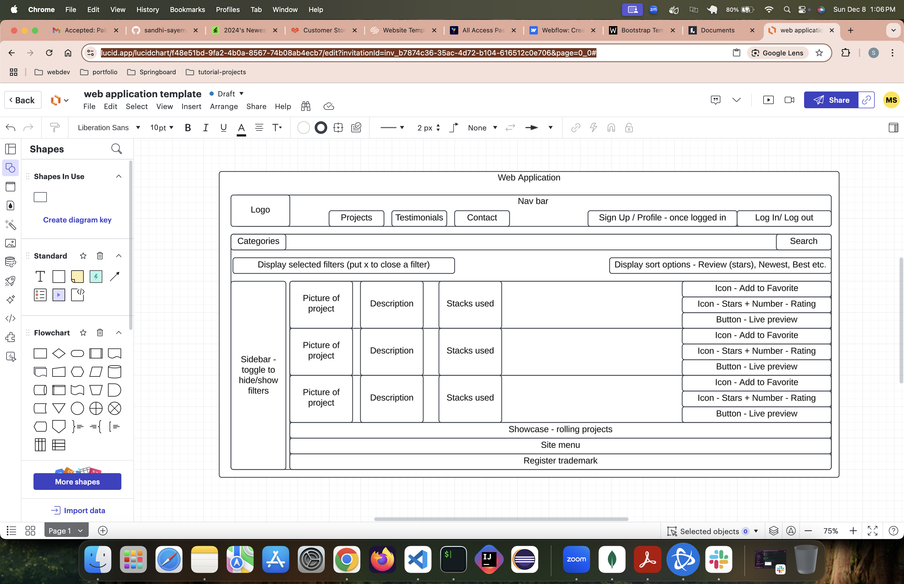

Application platform

Authors:

    Naeem Amiri
    Sandhi Sayem

Project Overview:

    This project will display all the full stack projects built by Naeem and Sandhi. Users will be able to filter by category, leave rating and review to each project. The goal of this project is to showcase the lifecycle of each project. The features of each project will demonstrate the full stack knowledge of authors.

    App architecture:

        # generate a diagram of the frontend, backend, and database communication

    Installation:

        # NPM instal for frontend and backend. npm start to generate backend web server and run the frontend client

    Backend:

        Stack: Express, Node

        API endpoints:

            # list of api endpoints

        Middleware:

            Authentication: ouath/token

            Authorization: # role based - admin vs users vs demo account

            Error handling: # Custom class - provide more info once the class is completed

        Database:

            Data storage: Mongo

            Authentication process: # URI/.env config file

            Filter logic: # most likely this will be based on mongoose running custom sqls

            CRUD: # mongoose built in methods

    Frontend:

        Stack: React, CSS

        Features:

            # sign up, sign out, log in, profile, search box, filters, ratings, reviews, categories, projects, projects profile, sliding projects

Usage:

    # Api endpoint for creating, updating, deleting records

Preview: # Display image of the app

